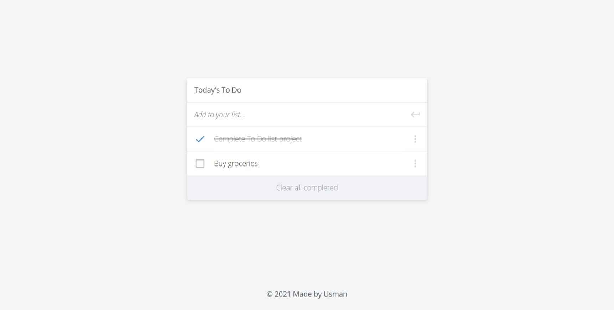

# Project Name


> One paragraph statement about the project.



Additional description about the project and its features.

## Built With

- HTML
- CSS
- JavaScript

## Live Demo

[Live Demo Link](https://livedemo.com)

## Getting Started

To get a local copy up and running follow these simple example steps.

### Prerequisites

- NodeJS - [v16.x](https://nodejs.org/en/)

### Setup

- Download or clone this repo on your computer
- Open your terminal in the project folder

### Install

```cmd
npm run build
```

```cmd
npm install
```

### Usage

```cmd
npm start
```

### Run tests

## Authors

👤 **Babakolo Usman Suleiman**

- GitHub: [@usmansbk](https://github.com/usmansbk)
- LinkedIn: [LinkedIn](https://www.linkedin.com/in/usman-suleiman-82b444140/)

## 🤝 Contributing

Contributions, issues, and feature requests are welcome!

Feel free to check the [issues page](../../issues/).

## Show your support

Give a ⭐️ if you like this project!

## Acknowledgments

- Microverse

## 📝 License

This project is [MIT](./MIT.md) licensed.
